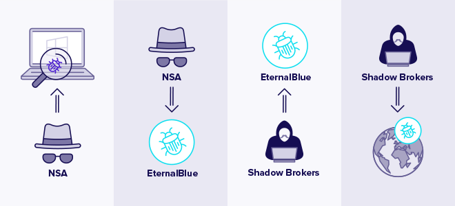
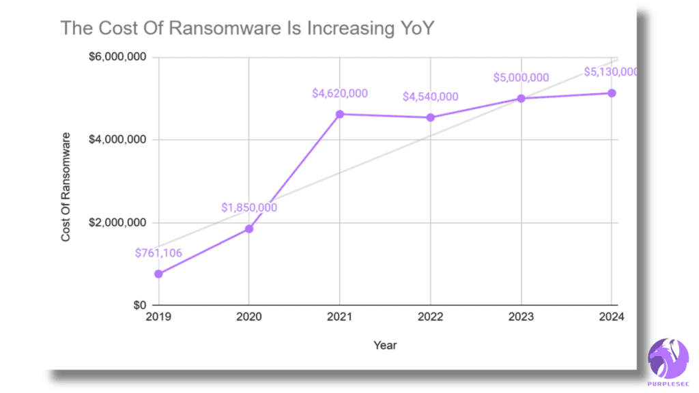

# Financial Sector Cyber Security Strategy: Global Finance Inc.

## 📄 Project Overview
[cite_start]This repository contains a comprehensive cybersecurity consultancy report developed as part of a University module [cite: 33-35]. [cite_start]The research focuses on assessing the cybersecurity stance of **Global Finance Inc.**, analyzing the modern threat landscape, and formulating a strategic roadmap for financial sector resilience [cite: 34-36].

## 🛡️ Strategic Analysis
[cite_start]The research evaluates the strategic implementation of **Cyber Threat Intelligence (CTI)** to move Global Finance Inc. toward a proactive defense posture [cite: 400-408]. Key focuses include:
* [cite_start]**Framework Alignment**: Integration of **ISO/IEC 27001** for risk-based management and the **NIST Cybersecurity Framework** for technical agility [cite: 110-115, 222-225].
* [cite_start]**Resilience Measures**: Implementation of Zero-Trust networks, Multi-Factor Authentication (MFA), and staff awareness training [cite: 228-232].

## 👥 Threat Actor Profiling
[cite_start]A deep-dive into the diverse motives and tactics of actors targeting financial institutions [cite: 49-55], including:
* [cite_start]**Nation-States**: Government-backed espionage and infrastructure disruption [cite: 355-360].
* [cite_start]**Insider Threats**: Malicious or negligent misuse of privileged access by employees or contractors [cite: 518-526].
* [cite_start]**Cyber Criminals**: Profit-driven campaigns focused on data theft and ransomware [cite: 361-365].

## 🔍 Vulnerability Case Study: EternalBlue (CVE-2017-0144)
[cite_start]The report features a chronological analysis of the **EternalBlue** exploit, from its development by the NSA to its eventual leak by the "Shadow Brokers" [cite: 142-146].
* [cite_start]**Impact**: Evaluation of the **WannaCry** attack, which leveraged this exploit to cause an estimated **$4 billion** in global losses[cite: 145, 146].
* [cite_start]**Technical Analysis**: Exploitation of the SMBv1 protocol to facilitate lateral movement and ransomware deployment [cite: 444-448].

## 📊 Industry Trends & Data Analysis
[cite_start]Analysis of the **Verizon 2025 Data Breach Investigations Report** shows that system intrusion accounts for **53% of attack types** in the financial sector [cite: 18-20]. [cite_start]The research highlights a positive correlation between the rise of sophisticated exploits and the escalating costs of ransomware recovery [cite: 494-497].

## 🛠️ Access Control Mechanisms
[cite_start]Comparative research into modern access control models to ensure 'least privilege' across the enterprise [cite: 151-154]:
* [cite_start]**RBAC (Role-Based Access Control)**: Streamlining access based on organizational roles[cite: 151, 152].
* [cite_start]**ABAC (Attribute-Based Access Control)**: Flexible, context-aware decisions based on user and system attributes [cite: 543-547].

---
*This report was authored by **Eugene Nleya** as a digital solutions consultancy case study.*
